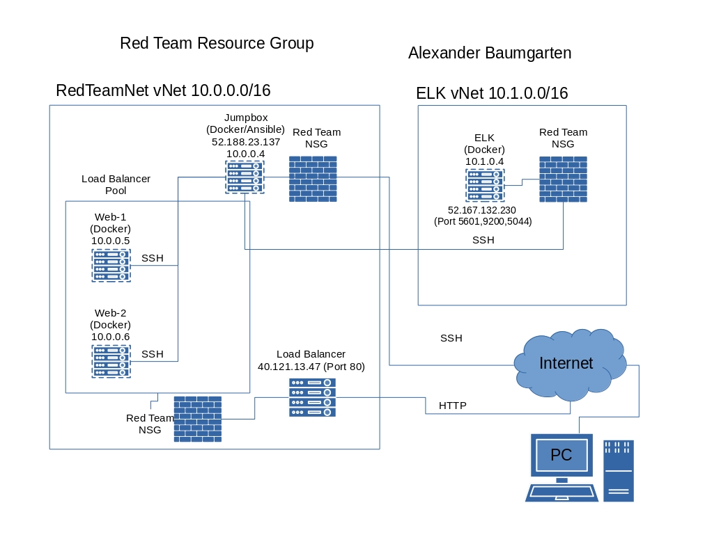
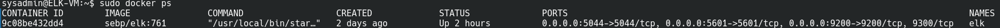

## Automated ELK Stack Deployment

The files in this repository were used to configure the network depicted below.



These files have been tested and used to generate a live ELK deployment on Azure. They can be used to either recreate the entire deployment pictured above. Alternatively, select portions of the _____ file may be used to install only certain pieces of it, such as Filebeat.

```yml
---
- name: Configure Elk VM with Docker
  hosts: elk
  become: True
  tasks:
    # Use apt module
    - name: Install docker.io
      apt:
        update_cache: yes
        force_apt_get: yes
        name: docker.io
        state: present

      # Use apt module
    - name: Install python3-pip
      apt:
        force_apt_get: yes
        name: python3-pip
        state: present

      # Use pip module (It will default to pip3)
    - name: Install Docker module
      pip:
        name: docker
        state: present

      # Use command module
    - name: Increase virtual memory
      command: sysctl -w vm.max_map_count=262144

      # Use sysctl module
    - name: Use more memory
      sysctl:
        name: vm.max_map_count
        value: 262144
        state: present
        reload: yes

      # Use docker_container module
    - name: download and launch a docker elk container
      docker_container:
        name: elk
        image: sebp/elk:761
        state: started
        restart_policy: always
        # Please list the ports that ELK runs on
        published_ports:
          -  5601:5601
          -  9200:9200
          -  5044:5044

```

This document contains the following details:
- Description of the Topology
- Access Policies
- ELK Configuration
  - Beats in Use
  - Machines Being Monitored
- How to Use the Ansible Build


### Description of the Topology

The main purpose of this network is to expose a load-balanced and monitored instance of DVWA, the D*mn Vulnerable Web Application.

Load balancing ensures that the application will be highly available, in addition to restricting access to the network.

- By creating a load balanced set of databases the availability of the information is greatly improved.

Integrating an ELK server allows users to easily monitor the vulnerable VMs for changes to the network and system resources.

- Filebeat watches an monitors the systems logs of all connected machines
- Metricbeat watches and records the various system info such as current CPU, RAM, and network usage

The configuration details of each machine may be found below.
_Note: Use the [Markdown Table Generator](http://www.tablesgenerator.com/markdown_tables) to add/remove values from the table_.

| Name     | Function | IP Address | Operating System |
|----------|----------|------------|------------------|
| JumpBox | Gateway  | 10.0.0.1   | Linux            |
| Web-1    | DB       | 10.0.0.5   | Linux            |
| Web-2    | DB       | 10.0.0.6   | Linux            |
| ELK      | Monitoring| 10.1.0.4   | Linux            |

### Access Policies

The machines on the internal network are not exposed to the public Internet. 

Only the JumpBox machine can accept connections from the Internet. Access to this machine is only allowed from the following IP addresses:
- 98.235.-.-/32

Machines within the network can only be accessed by the ansible container within JumpBox.
- Ansible container with Jumpbox(10.0.0.4) is the only device allowed to connect to the other VMs in either vNet

A summary of the access policies in place can be found in the table below.

| Name     | Publicly Accessible | Allowed IP Addresses |
|----------|---------------------|----------------------|
| JumpBox | Yes                 | 98.235.-.-/32    |
| Web-1 |  No            | 10.0.0.4 |
| Web-2 |  No            | 10.0.0.4 |
| ELK   | No            | 10.0.0.4 |

### Elk Configuration

Ansible was used to automate configuration of the ELK machine. No configuration was performed manually, which is advantageous because...
- By using Ansible to configure the remote VMs the admin/user can create reproducible and consistent results when configuring multiple machines at once

The playbook implements the following tasks:
- _TODO: In 3-5 bullets, explain the steps of the ELK installation play. E.g., install Docker; download image; etc._
- Installs docker.io via apt
- Installs python3-pip via apt
- Installs docker python module via pip
- Use systemctl to increase and use more virtual memory
- Pull, configure, and run docker container on VM startup

The following screenshot displays the result of running `docker ps` after successfully configuring the ELK instance.

```
CONTAINER ID        IMAGE               COMMAND                  CREATED             STATUS              PORTS                                                                              NAMES
9c08be432dd4        sebp/elk:761        "/usr/local/bin/star…"   2 days ago          Up 2 hours          0.0.0.0:5044->5044/tcp, 0.0.0.0:5601->5601/tcp, 0.0.0.0:9200->9200/tcp, 9300/tcp   elk

```



### Target Machines & Beats
This ELK server is configured to monitor the following machines:
- Web-1 (10.0.0.5)
- Web-2 (10.0.0.6)
- ELK (10.1.0.4)

We have installed the following Beats on these machines:
- Filebeats
- Metricbeats

These Beats allow us to collect the following information from each machine:
- Filebeats collects and transfers system logs from the target machines to the ELK server for data visualization via Kibana
- Metricbeats gathers usage information of the target system resources such as RAM, CPU, and network usage
- _TODO: In 1-2 sentences, explain what kind of data each beat collects, and provide 1 example of what you expect to see. E.g., `Winlogbeat` collects Windows logs, which we use to track user logon events, etc._

### Using the Playbook
In order to use the playbook, you will need to have an Ansible control node already configured. Assuming you have such a control node provisioned: 

SSH into the control node and follow the steps below:
- Copy the .yml file to the control node.
- Update the .yml file to include the target hosts
- Run the playbook, and navigate to the Kibana web GUI to check that the installation worked as expected.

_TODO: Answer the following questions to fill in the blanks:_
- The `.yml` file is the playbook file _Which file is the playbook? Where do you copy it?_
- By updating the `hosts` section of the playbook, you change what machiens are targeted when running the playbook _Which file do you update to make Ansible run the playbook on a specific machine? How do I specify which machine to install the ELK server on versus which to install Filebeat on?_
- Navigate to `http://<public IP>:5601/app/kibana#/home` in-order to see of the ELK server is up and running 
